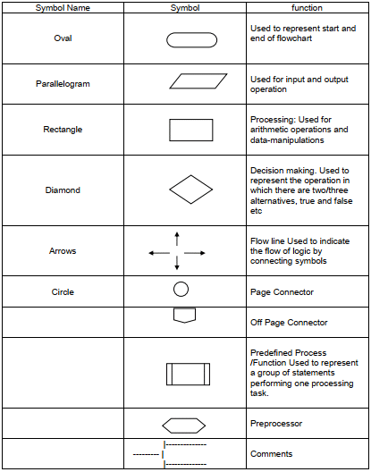

<h6>
In this video, We would learn about what is flow chart & what is pseudocode. What is use of programming amd why to do programming?
</h6>
<ul>
  <li>
    <b>FlowChart:</b> It is visual representation of program using diagrams amd shapes having a fixed meaning. 
    Example : In a flow chart the <b>Eclipse</b> denotes the starting and end of the program. 
    <b>Parallelogram</b> denotes the input or output statement.  
    <b>Rectangle</b> denotes the calculation or some arthimatic operations. 
    <b>Rhombus</b> denotes the decision or comparison, etc. 
    <b>Note : There is no symbol or shape for loops but decision shape can be used to make loop.</b>  
    
  </li>
  <li>
    <b>PseudoCode: </b> It is general instructions without any syntax but once it is written it can be easily converted into a code.
  </li>
  <li>
    <b>Programming Languages </b> are special lamguages which can be conberted into computer understandable format which is written in a fix format known as syntax.
  </li>
  <li>
    We know that a computer can perform calculations and other action better than human beings but we can't give instuctions directly to computer as it only understand 0 and 1. so we write a program in a human understandable format and then a program convert it into the computer understandable program this program is known as compiler.
  </li>
</ul>
